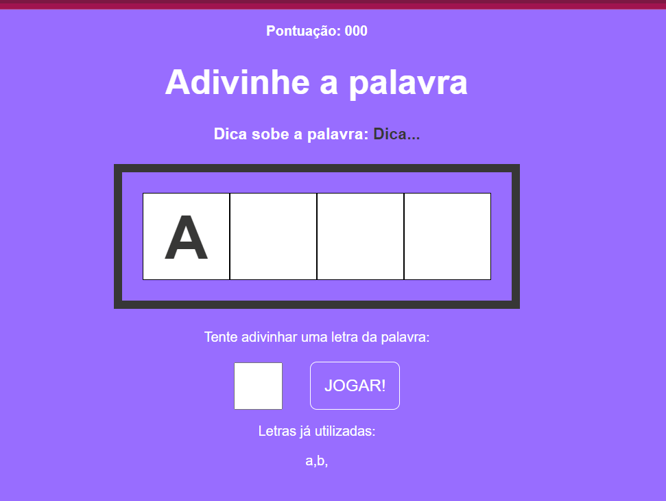

# Secret Word

**Secret Word** é um jogo de adivinhação de palavras onde o jogador deve adivinhar a palavra secreta antes que suas tentativas acabem. Este projeto foi desenvolvido usando React e Vite, proporcionando uma experiência de desenvolvimento rápida e eficiente.

## Funcionalidades

- Escolha de palavras aleatórias para o jogador adivinhar.
- Exibe letras corretamente adivinhadas.
- Exibe tentativas restantes e letras já utilizadas.
- Mensagens de vitória ou derrota com base no desempenho do jogador.

## Tecnologias Utilizadas

- **React**: Biblioteca JavaScript para construção de interfaces de usuário.
- **Vite**: Ferramenta de build rápida e leve para desenvolvimento web.

## Pré-requisitos

Certifique-se de ter as seguintes ferramentas instaladas em seu sistema:

- **Node.js**: Versão 14 ou superior.
- **npm** ou **yarn**: Gerenciador de pacotes JavaScript.
